# 🦖 Jobzilla AI (formerly KillMatch)

**The AI-Powered Job Application Assistant that helps you land your dream job.**

---

## 🏗️ System Architecture

```mermaid
graph TD
    %% Styling
    classDef frontend fill:#e1f5fe,stroke:#01579b,stroke-width:2px;
    classDef backend fill:#e8f5e9,stroke:#2e7d32,stroke-width:2px;
    classDef ai fill:#fff3e0,stroke:#ef6c00,stroke-width:2px;
    classDef db fill:#f3e5f5,stroke:#7b1fa2,stroke-width:2px;
    classDef ext fill:#eceff1,stroke:#455a64,stroke-width:2px;

    %% Client Layer
    Client[🖥️ Streamlit Frontend]:::frontend <-->|HTTP/JSON| API[🚀 FastAPI Backend]:::backend

    %% Backend Services
    subgraph "Backend Infrastructure"
        API <-->|SQLAlchemy| DB[(🐘 PostgreSQL)]:::db
        API <-->|Redis-py| Cache[(⚡ Redis)]:::db
        API <-->|Vector Search| VectorDB[(🌲 Pinecone)]:::db
    end

    %% AI Logic
    subgraph "LangGraph Agent Workflow"
        API -->|Orchestrate| Graph[StateGraph]:::ai
        Graph -->|Analyze| Recruiter[🔴 Recruiter Agent]:::ai
        Graph -->|Advocate| Coach[🟢 Coach Agent]:::ai
        Graph -->|Decide| Judge[⚖️ Judge Agent]:::ai
        Recruiter <-->|Debate| Coach
        Coach <-->|Debate| Judge
    end

    %% External Context
    subgraph "Context Providers (MCP)"
        API <-->|MCP Protocol| JobMCP[💼 Job Market MCP]:::ext
        API <-->|MCP Protocol| GitMCP[🐙 GitHub MCP]:::ext
    end
    
    JobMCP -.->|Scrape| Web[🌍 LinkedIn/Indeed]
    GitMCP -.->|REST API| GitHub[GitHub API]
```



## 💻 Technologies and Tools


## ✨ Key Features

### 🤖 Multi-Agent Debate
Instead of a simple "match score," three AI agents debate your candidacy:
- **🔴 The Recruiter**: Plays devil's advocate, finding every weakness in your profile.
- **🟢 The Career Coach**: Advocates for you, highlighting transferable skills and potential.
- **⚖️ The Judge**: Weighs both sides and gives a final, unbiased verdict.

### 🔍 Semantic Job Search
Forget keyword matching. Jobzilla uses **Vector Embeddings (OpenAI)** to understand the *meaning* of your resume and finds jobs that match your actual skills, not just keywords.

### 📝 Intelligent Cover Letters
Generates hyper-personalized cover letters that:
- Address specific requirements in the job description
- Highlight your most relevant projects
- Adopt the company's tone and culture

### 🐙 GitHub Portfolio Analysis
Connects to your GitHub via **MCP Server** to analyze your code quality, languages, and contributions, adding "hard proof" of your skills to your profile.

## ⚙️ Setup Instructions (Step-by-Step Guide)

### 1. Clone the Repository
```bash
git clone https://github.com/sahilk710/jobzilla-ai.git
cd jobzilla-ai
```

### 2. Configure Environment
Create a `.env` file in the root directory (use `.env.example` if available, or ask the developer).

### 3. Run with Docker
The system uses Docker Compose to manage all services (Backend, Frontend, Database, Redis, etc.) seamlessly.
```bash
docker-compose up -d --build
```

### 4. Access the Application
- **Frontend**: http://localhost:8501
- **Backend API Docs**: http://localhost:8000/docs
- **Airflow**: http://localhost:8080

---

## � Project Structure

```
jobzilla-ai/
├── backend/            # FastAPI Application
│   ├── app/
│   │   ├── agents/     # LangGraph Agent Definitions
│   │   ├── api/        # API Routes
│   │   └── models/     # Pydantic Models
├── frontend/           # Streamlit Application
├── mcp_servers/        # External Data Connectors
│   ├── github-context/ # GitHub API Connector
│   └── job-market/     # LinkedIn/Indeed Scraper
├── airflow/            # Scheduled Tasks (DAGs)
└── docker-compose.yml  # Infrastructure Definition
```

---

## 🤝 Contributing

1. Fork the repository
2. Create feature branch (`git checkout -b feature/amazing-feature`)
3. Commit changes (`git commit -m 'Add amazing feature'`)
4. Push to branch (`git push origin feature/amazing-feature`)
5. Open a Pull Request

---

*Powered by Caffeine and LLMs ☕🤖*
